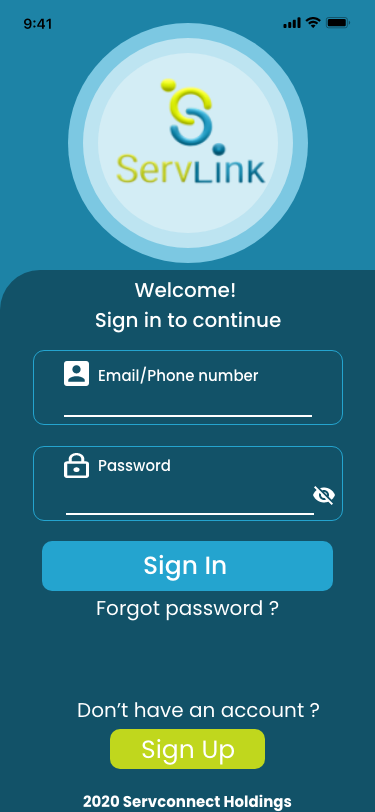

##<span style="font-family:serif; font-size:2.5em">Problem Statement</span>
<span style="font-family:serif; font-size:1.5em">
    Servlink is a service app that runs in a similar fashion as the prominent Uber app. A service request is logged on the app and a service provider renders the service requested. Service providers will be listed on the app by their range of services from mobile hairdressing, plumbing, babysitting, etc and the service requester will select from a pool of service providers based on rating and location. The challenge was to design a UI/UX given the above problem statement.
</span>

##<span style="font-family:serif; font-size:2.5em">Approach</span>

##<span style="font-family:serif; font-size:2.5em">Results</span>
<span style="font-family:serif; font-size:1.5em">
    We created three themes as requested by the client:<br>
    1. Light mode<br>
    2. Default mode<br>
    3. Dark mode<br>
    The login screen for the app is displayed for each mode below, from lightest to darkest theme (left to right). To view the full project  you can click the 'see full project' button at the bottom of the images, password: Servlink2020
</span>

##<span style="font-family:Poppins; font-size:1.5em">Login screens</span>
```grid|3|
 


```
##<span style="font-family:Poppins; font-size:1.5em">Landing screens</span>
```grid|3|
 


```
##<span style="font-family:Poppins; font-size:1.5em">Request a service screens</span>
```grid|3|
 


```
##<span style="font-family:Poppins; font-size:1.5em">User Profile screens</span>
```grid|3|
 


```


